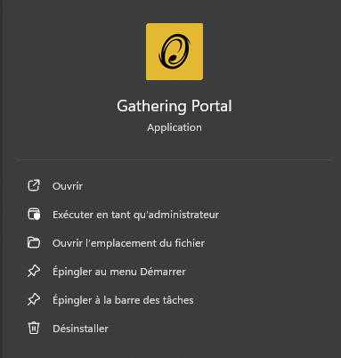
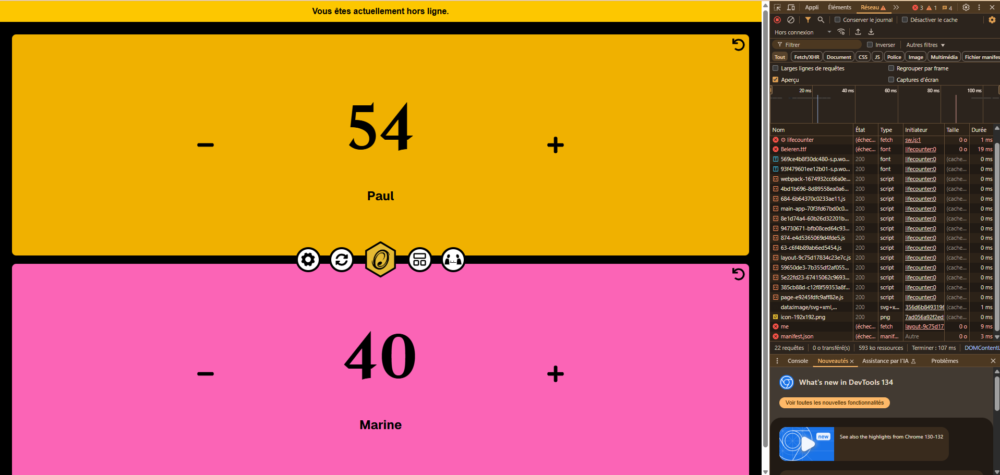
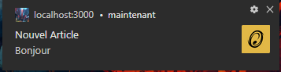

# Projet PWA – GatheringPortal

## Réalisé par

**Paul Debril** et **Marine Langrez**  
Dans le cadre du cours *TypeScript & PWA-  MyDigitalSchool* 

Lien du site web: https://gatheringportal.vercel.app/

---

## Objectif du projet

Ce projet a été réalisé dans le cadre du cours **"TypeScript & PWA"**, dont l’objectif est de développer une application typescript en ajoutant des fonctionnalités d'une PWA.

Notre application, **GatheringPortal**, est un site web destiné aux fans du jeu de cartes **Magic: The Gathering**.  
Il propose plusieurs pages (actualités, recherche de cartes, gestion de compte) et intègre des mécanismes propres aux PWA.y.

---

## Fonctionnalités implémentées

Le détail de toutes les fonctionnalités de l'application se trouve dans `README.features.md`

## Fonctionnalités PWA implémentées

### Installation en tant qu'application

- L’application est installable via les navigateurs compatibles (Chrome, Edge, etc.).
- Un **fichier manifeste** et un **service worker** ont été configurés pour activer ce comportement.
- Une fois installée, l’application peut être lancée comme une app native.

### Mise en cache & fonctionnement hors-ligne

- Utilisation d’un **service worker** pour **mettre en cache les pages et ressources principales**.
- En cas de perte de connexion, certaines pages restent accessibles : l'utilisateur peut consulter le contenu déjà visité même sans internet.

Par exemple ici, imaginons que l'utilisateur était en train d'utiliser l'outil lifecounter, meme si la connection internet s'interrompt la page restera entièrement fonctionnel et sera juste en mode hors ligne, avec une bannière qui restera affiché pour informer l'utilisateur.

### Notifications push

- Un système de **notifications push** a été mis en place.
- Lorsqu’un **nouvel article** est publié dans la section actualités, une notification est envoyée aux utilisateurs ayant activé cette option.
- Les notifications fonctionnent sur desktop et mobile (sous réserve d’acceptation par l’utilisateur).

- La fonctionnalité d'envoie de notification peux directement être testé dans la page :
https://gatheringportal.vercel.app/user-preferences
---

## Pertinence du sujet

Le choix de créer un site autour de **Magic: The Gathering** est pertinent dans le cadre d’une PWA, car :

- Il y a des **consultations fréquentes** de la part de l’utilisateur, justifiant la mise en cache et l'installation.
- Système de **notifications** pour informer les joueurs des nouveautés.

---

## Technologies utilisées

- **Frontend et backend** : Next.js (React)
- **Langage principal** : TypeScript
- **Base de données** : Supabase (PostgreSQL)
- **PWA** : next-pwa
- **Versionnement** : Git / GitHub (dépôt public)
- **Déploiement** : Vercel

---

## Documents

Le projet a été versionné sur un dépôt GitHub public, contenant :

- Un fichier `README.md` avec la procédure d’installation
- Un fichier `README.features.md` pour décrire les fonctionnalités
- Le présent fichier `README.projetpwa.md` dédié au contexte du projet de cours
---

## Fonctionnalités à venir

Dans le **temps imparti pour le projet de cours "TypeScript & PWA"**, nous n’avons pas pu implémenter l’ensemble des fonctionnalités envisagées.  
Voici toutefois un aperçu de ce que nous aimerions développer par la suite pour enrichir **GatheringPortal** :

- Finalisation des pages **Guide**, **Collection** et **Decks**
- Intégration d’un **moteur de recherche avancé** avec filtres multicritères pour les cartes
- Amélioration continue de la **performance, de l’ergonomie et de l’accessibilité mobile**
- Nouveaux outils pour les joueurs
- ...
